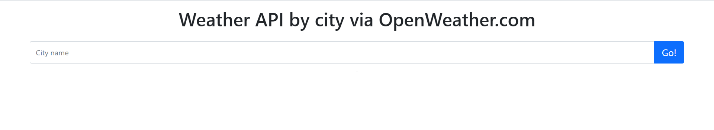

# weather-API



a small project using the [openweathermap](https://openweathermap.org/api) to provide the forecast info on a submitted city of choice.
## Getting Started

- Clone the repository to your machine with `git clone https.....`
- then `cd` into it
- then `code .` to open your code editor and start coding

### Prerequisites

Don't forget to get your API by registering on the website first.

### Installing

Have Ubuntu command line
Have Visual Studio code

or use your own version of those two above.

## Running the tests

I used `console.log()` in the DOM to see that each snippet of code was working properly.
```

## Deployment

Deploy using GitHub pages or Netlify.

## Built With

HTML, CSS, JS, Bootstrap, API

## Author

* **Gabriel G** - 

API and data belong to the caompnies providing them and they are not associated or represent my work.

## License

This project is licensed under the MIT License - see the [LICENSE.md](LICENSE.md) file for details

## Acknowledgments

* Hat tip to OpenWeatherMap for the free API
* Inspiration planet Earth
